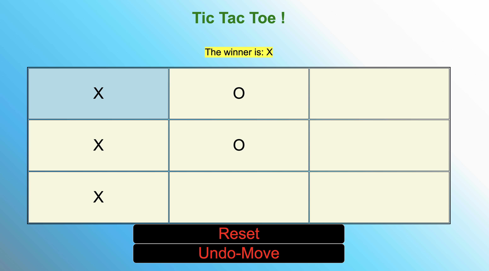

# Simple ticTacToe
This is a simple tic tac toe game.

## Tech used: HTML, Javascript, and CSS!

## How I Made It
  I used different loops to go through the game board array and checking if an
  item had already been printed on it. This way, the counter would be able to
  check for a winning combination at any step along the way.

## Lessons Learned:
Though the game is operational, I would like to go in and redo this
project with a more Object Oriented Programming approach.

